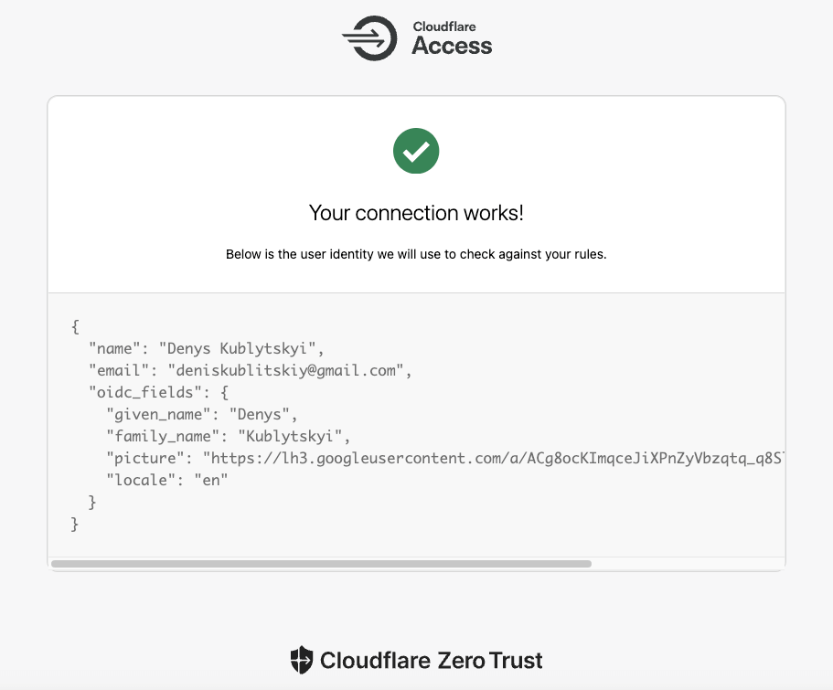

# use-cf-zero-trust-auth

In the **Zero Trust** dash select **Setting** in the side menu then select **Authentication** and choose the needed **Login method**. Scroll to **Optional configurations** to **OIDC Claims** and add needed claims.
You can find claims for Google [here](https://accounts.google.com/.well-known/openid-configuration) in the **claims_supported** section.


Click **Test** button and make sure that you see needed claims in response in the **oidc_fields** property.



Disable **HTTP only** option in the Application **Cookies settings** section.


```typescript jsx 

import useCFZeroTrustAuth from "use-cf-zero-trust-auth";
import { Avatar, Stack, Typography } from "@mui/material";

// Claims that you added in the Zero Trust OIDC Claims section
type Claims = {
    family_name?: string;
    given_name: string;
    picture: string;
    locale: string;
};

const Customer = () => {
    const { token, signOut } = useCFZeroTrustAuth<Claims>();
    
    return <Stack
        spacing={2}
        direction="row"
        alignItems="center"
    >
        <Avatar src={token?.custom?.picture} />
        <Typography>
            {[token?.custom?.given_name, token?.custom?.family_name]
                .filter(Boolean)
                .join(" ")}
        </Typography>
    </Stack>
}
```
